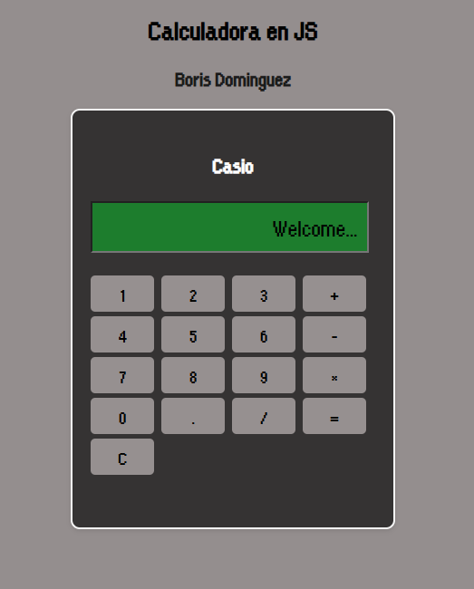

# Calculadora JS

Calculadora básica desarrollada con HTML, CSS y JavaScript.

## Demo en vivo

[Ver calculadora](https://borisdominguezm.github.io/calculadora-js/)

## Características

* Operaciones matemáticas básicas
* Interfaz inspirada en calculadoras Casio
* Fuente personalizada
* Manipulación del DOM con JavaScript

## Tecnologías utilizadas

* HTML5
* CSS3
* JavaScript

## Captura del proyecto

## Cómo ejecutar el proyecto

1. Descargar o clonar el repositorio
2. Abrir `index.html` en el navegador

## Estado del proyecto

Proyecto finalizado como práctica de JavaScript y manipulación del DOM.
